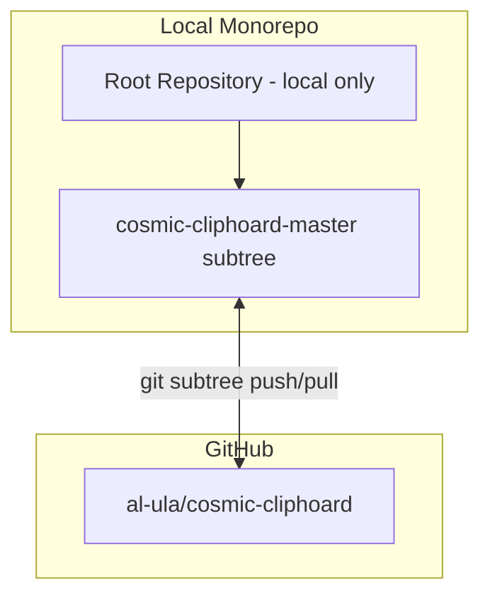

# Monorepo Migration Plan: Git Subtree

## Overview

Convert the current nested repository structure into a monorepo with `git subtree`, keeping `cosmic-cliphoard-master` as a subtree pointing to the existing remote repository.

## Current Structure

```
cosmic-cliphoard/                    # No git repository
├── PLAN.MD
├── .claude/
├── .playwright/
├── cosmic-cliphoard-master/         # Nested git repository
│   ├── .git/                        # Points to git@github.com:al-ula/cosmic-cliphoard.git
│   ├── Cargo.toml
│   ├── cliphoard/
│   ├── cliphoard-applet/
│   ├── cliphoard-backend/
│   ├── cliphoard-schema/
│   └── cliphoard-tray/
└── plans/
```

## Target Structure

```
cosmic-cliphoard/                    # Root git repository - local only
├── PLAN.MD
├── .gitignore
├── .claude/
├── .playwright/
├── cosmic-cliphoard-master/         # Git subtree - tracks git@github.com:al-ula/cosmic-cliphoard.git
│   ├── Cargo.toml
│   ├── cliphoard/
│   ├── cliphoard-applet/
│   ├── cliphoard-backend/
│   ├── cliphoard-schema/
│   └── cliphoard-tray/
└── plans/
```

## Migration Steps

### Phase 1: Preparation

1. **Backup the existing nested repository**
   - Create a backup of the `.git` directory in case anything goes wrong
   - Command: `cp -r cosmic-cliphoard-master/.git ../cosmic-cliphoard-backup.git`

2. **Remove the nested `.git` directory**
   - This is required to avoid conflicts with the new root repository
   - Command: `rm -rf cosmic-cliphoard-master/.git`

### Phase 2: Initialize Root Repository

3. **Initialize git at root level**
   - Command: `git init`

4. **Create root `.gitignore`**
   - Include entries for Rust projects, IDE files, and other common ignores
   - See `.gitignore` template below

5. **Stage and commit root files**
   - Commands:
     ```bash
     git add .
     git commit -m "Initial commit: setup monorepo structure"
     ```

### Phase 3: Add Subtree

6. **Add cosmic-cliphoard-master as a subtree**
   - This will fetch the entire history from the remote and place it in the specified prefix
   - Command:
     ```bash
     git subtree add --prefix=cosmic-cliphoard-master git@github.com:al-ula/cosmic-cliphoard.git master
     ```

7. **Verify the subtree was added correctly**
   - Command: `git log --oneline -n 10`
   - Should show commits from both the initial commit and the subtree

### Phase 4: Configure Subtree Remote (Optional but Recommended)

8. **Add a named remote for easier subtree operations**
   - Command:
     ```bash
     git remote add cosmic-cliphoard git@github.com:al-ula/cosmic-cliphoard.git
     ```

9. **Update subtree from remote**
   - Command:
     ```bash
     git subtree pull --prefix=cosmic-cliphoard-master cosmic-cliphoard master
     ```

## Post-Migration Workflow

### Pulling Upstream Changes

```bash
git subtree pull --prefix=cosmic-cliphoard-master cosmic-cliphoard master
```

### Pushing Changes Upstream

```bash
git subtree push --prefix=cosmic-cliphoard-master cosmic-cliphoard master
```

### Contributing Back to Subtree

If you make changes to files in `cosmic-cliphoard-master/` that should be pushed back:

```bash
# Make changes in cosmic-cliphoard-master/
git add cosmic-cliphoard-master/
git commit -m "Fix: description of change"
git subtree push --prefix=cosmic-cliphoard-master cosmic-cliphoard master
```

## .gitignore Template

```gitignore
# Rust
target/
Cargo.lock
**/*.rs.bk

# IDE
.idea/
.vscode/
*.swp
*.swo

# OS
.DS_Store
Thumbs.db

# Build artifacts
*.o
*.so
*.dylib
*.dll

# Playwright
.playwright/
node_modules/

# Backup files
*.bak
*.backup
```

## Architecture Diagram



## Advantages of This Approach

1. **Single source of truth** - All project files in one repository
2. **Simplified workflow** - No need to manage multiple `.git` directories
3. **Upstream sync** - Can easily pull/push changes to the original repository
4. **Atomic commits** - Changes across the monorepo can be committed together
5. **No submodules** - Avoids the complexity and pitfalls of git submodules

## Potential Issues and Solutions

| Issue | Solution |
|-------|----------|
| Merge conflicts when pulling upstream | Resolve conflicts manually, then commit |
| Accidentally committing to wrong location | Use clear commit messages indicating subtree changes |
| Large repository size | Git subtree includes full history; acceptable for this project size |

## Verification Checklist

After migration, verify:

- [ ] Root repository initialized correctly
- [ ] All files from `cosmic-cliphoard-master` present in subtree
- [ ] Can pull updates from remote: `git subtree pull --prefix=cosmic-cliphoard-master cosmic-cliphoard master`
- [ ] Git history preserved from original repository
- [ ] No nested `.git` directories remain

---

## Daily Workflow Guide

### Understanding the Structure

```
cosmic-cliphoard/                    # Root repo - your working directory
├── cosmic-cliphoard-master/         # Subtree - synced with GitHub
│   └── ... (Rust crates)
├── plans/                           # Root-level files - NOT synced with subtree remote
├── .claude/                         # Root-level files - NOT synced with subtree remote
└── PLAN.MD                          # Root-level files - NOT synced with subtree remote
```

### Scenario 1: Working on Root-Level Files

Files like `PLAN.MD`, `plans/`, `.claude/` are NOT part of the subtree.

```bash
# Edit files
vim PLAN.MD

# Normal git workflow
git add PLAN.MD
git commit -m "docs: update plan"
```

### Scenario 2: Working on Subtree Files

When editing files inside `cosmic-cliphoard-master/`, you have two options:

#### Option A: Commit to Root Only (Local Changes)

```bash
# Edit subtree files
vim cosmic-cliphoard-master/cliphoard-backend/src/main.rs

# Commit to root repository
git add cosmic-cliphoard-master/
git commit -m "feat: add backend functionality"
```

These changes stay local until you explicitly push to the subtree remote.

#### Option B: Push to Upstream (Share Changes)

```bash
# After committing to root
git add cosmic-cliphoard-master/
git commit -m "feat: add backend functionality"

# Push subtree changes to GitHub
git subtree push --prefix=cosmic-cliphoard-master cosmic-cliphoard master
```

### Scenario 3: Pulling Upstream Changes

When the remote repository has new commits:

```bash
# Fetch and merge upstream changes into subtree
git subtree pull --prefix=cosmic-cliphoard-master cosmic-cliphoard master
```

### Scenario 4: Mixed Changes (Root + Subtree)

```bash
# Edit both root and subtree files
vim PLAN.MD
vim cosmic-cliphoard-master/cliphoard/src/app.rs

# Option 1: Commit separately for clarity
git add PLAN.MD
git commit -m "docs: update plan"

git add cosmic-cliphoard-master/
git commit -m "feat: update app"

# Option 2: Commit together (not recommended for subtree pushes)
git add .
git commit -m "docs: update plan and app"
```

---

## Quick Reference Commands

### Subtree Operations

| Action | Command |
|--------|---------|
| Pull upstream changes | `git subtree pull --prefix=cosmic-cliphoard-master cosmic-cliphoard master` |
| Push to upstream | `git subtree push --prefix=cosmic-cliphoard-master cosmic-cliphoard master` |
| View subtree history | `git log --oneline --prefix=cosmic-cliphoard-master` |
| Add new subtree | `git subtree add --prefix=<path> <remote-url> <branch>` |

### Useful Git Aliases

Add these to your `.gitconfig` for convenience:

```ini
[alias]
    # Subtree shortcuts
    sub-pull = "!f() { git subtree pull --prefix=$1 $2 ${3:-master}; }; f"
    sub-push = "!f() { git subtree push --prefix=$1 $2 ${3:-master}; }; f"
    
    # Project-specific shortcuts
    clip-pull = "subtree pull --prefix=cosmic-cliphoard-master cosmic-cliphoard master"
    clip-push = "subtree push --prefix=cosmic-cliphoard-master cosmic-cliphoard master"
```

Usage after adding aliases:
```bash
git clip-pull   # Pull from cosmic-cliphoard remote
git clip-push   # Push to cosmic-cliphoard remote
```

---

## Guidelines for AI Assistant (Kilo Code)

### When Making Changes to Subtree Files

1. **Always inform the user** when changes affect `cosmic-cliphoard-master/`
2. **Ask before pushing** - subtree pushes should be explicit user actions
3. **Use clear commit messages** that distinguish subtree changes from root changes

### Recommended Commit Message Format

```
<type>(<scope>): <description>

# Examples:
feat(backend): implement D-Bus service
fix(applet): resolve popup positioning
docs(schema): add codec documentation
chore(root): update .gitignore          # For root-level changes
```

### When User Says...

| User Request | Action |
|--------------|--------|
| "Push to upstream" | Run `git subtree push --prefix=cosmic-cliphoard-master cosmic-cliphoard master` |
| "Pull latest" | Run `git subtree pull --prefix=cosmic-cliphoard-master cosmic-cliphoard master` |
| "Sync with remote" | Pull first, then push if needed |
| "Commit changes" | Normal `git commit` - changes go to root repo |

---

## Troubleshooting

### Problem: "fatal: refusing to merge unrelated histories"

This happens when the subtree was added but histories don't share a common ancestor.

**Solution:**
```bash
git subtree pull --prefix=cosmic-cliphoard-master cosmic-cliphoard master --allow-unrelated-histories
```

### Problem: Merge conflicts during subtree pull

**Solution:**
```bash
# 1. Identify conflicted files
git status

# 2. Resolve conflicts manually in the conflicted files
# 3. Stage resolved files
git add <resolved-files>

# 4. Complete the merge
git commit
```

### Problem: Push rejected (non-fast-forward)

This happens when remote has commits not in local subtree.

**Solution:**
```bash
# Pull first to get remote changes
git subtree pull --prefix=cosmic-cliphoard-master cosmic-cliphoard master

# Then push
git subtree push --prefix=cosmic-cliphoard-master cosmic-cliphoard master
```

### Problem: Accidentally committed to wrong location

If you committed root-level changes but meant to push to subtree:

```bash
# Cherry-pick the commit to a new branch, then subtree push
# Or simply: the commit is in root, just subtree push if it's in cosmic-cliphoard-master/
git subtree push --prefix=cosmic-cliphoard-master cosmic-cliphoard master
```

---

## Migration Execution Checklist

When ready to execute the migration:

```bash
# 1. Backup existing .git
cp -r cosmic-cliphoard-master/.git ../cosmic-cliphoard-backup.git

# 2. Remove nested .git
rm -rf cosmic-cliphoard-master/.git

# 3. Initialize root repository
git init

# 4. Create .gitignore (copy from template above)
# ... create .gitignore file ...

# 5. Initial commit
git add .
git commit -m "chore: initialize monorepo structure"

# 6. Add remote for subtree
git remote add cosmic-cliphoard git@github.com:al-ula/cosmic-cliphoard.git

# 7. Add subtree (this will fetch and merge the remote history)
git subtree add --prefix=cosmic-cliphoard-master cosmic-cliphoard master

# 8. Verify
git log --oneline -n 5
git remote -v
```

---

## Summary

| What | Where | Synced with GitHub? |
|------|-------|---------------------|
| Root files (`PLAN.MD`, `plans/`, etc.) | Root repo | No |
| `cosmic-cliphoard-master/` | Subtree | Yes |
| Commit history | Root repo | Mixed (root + subtree) |

**Key Commands:**
- `git subtree pull --prefix=cosmic-cliphoard-master cosmic-cliphoard master` - Sync from GitHub
- `git subtree push --prefix=cosmic-cliphoard-master cosmic-cliphoard master` - Sync to GitHub
