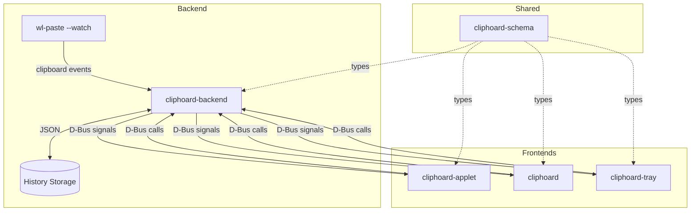

# Cosmic Cliphoard - Progress Review

## Project Overview

**Goal:** Create a wl-clipboard based clipboard manager for the COSMIC desktop environment.

**Architecture:** Cargo workspace with multiple crates for different components:
- **cliphoard-schema** - Shared types and D-Bus interface definitions
- **cliphoard-backend** - Background service managing clipboard history
- **cliphoard-applet** - COSMIC panel applet UI
- **cliphoard** - Full COSMIC application
- **cliphoard-tray** - System tray app for non-COSMIC environments

---

## Implementation Status

### ✅ cliphoard-schema (Complete)

The schema crate is well-implemented with comprehensive types and tests.

| Module | Status | Description |
|--------|--------|-------------|
| [`entry.rs`](cosmic-cliphoard-master/cliphoard-schema/src/entry.rs) | ✅ Complete | `ClipboardEntry` and `EntryId` types with timestamp, pinning, preview |
| [`history.rs`](cosmic-cliphoard-master/cliphoard-schema/src/history.rs) | ✅ Complete | `ClipboardHistory` with VecDeque, eviction logic, pinning, search |
| [`dbus.rs`](cosmic-cliphoard-master/cliphoard-schema/src/dbus.rs) | ✅ Complete | D-Bus proxy trait with all methods defined |
| [`codec.rs`](cosmic-cliphoard-master/cliphoard-schema/src/codec.rs) | ✅ Complete | `BincodeCodec` and `JsonCodec` for serialization |
| [`mime.rs`](cosmic-cliphoard-master/cliphoard-schema/src/mime.rs) | ✅ Complete | `MimeType` enum with parsing and classification |

**Key Features:**
- Dual serialization support (bincode for IPC, JSON for storage)
- D-Bus interface with signals for `entry_added`, `entry_removed`, `history_cleared`
- Unit tests for all modules

---

### ❌ cliphoard-backend (Not Started)

| File | Status | Notes |
|------|--------|-------|
| [`main.rs`](cosmic-cliphoard-master/cliphoard-backend/src/main.rs) | ❌ Placeholder | Only prints "Hello, world!" |
| [`lib.rs`](cosmic-cliphoard-master/cliphoard-backend/src/lib.rs) | ❌ Empty | No implementation |

**Required Implementation:**
1. D-Bus service implementing `ClipboardManager` interface
2. wl-clipboard monitoring via `wl-paste --watch`
3. History persistence to disk (JSON format)
4. Integration with `wl-copy` for pasting entries

---

### ⚠️ cliphoard-applet (Template Only)

Currently a COSMIC applet template without clipboard functionality.

| Component | Status | Notes |
|-----------|--------|-------|
| App structure | ✅ Template | Basic COSMIC applet setup |
| Popup window | ✅ Template | Toggle popup with settings item |
| D-Bus client | ❌ Missing | No connection to backend |
| History display | ❌ Missing | No clipboard entry list |
| wl-clipboard | ❌ Missing | No monitoring setup |

**Required Implementation:**
1. Connect to backend via D-Bus using `ClipboardManagerProxy`
2. Display clipboard history in popup
3. Handle entry selection (paste to clipboard)
4. Add pin/delete actions

---

### ⚠️ cliphoard (Template Only)

Currently a COSMIC app template with placeholder pages.

| Component | Status | Notes |
|-----------|--------|-------|
| App structure | ✅ Template | Nav bar with 3 placeholder pages |
| Config | ✅ Template | Basic config loading |
| D-Bus client | ❌ Missing | No connection to backend |
| History view | ❌ Missing | No clipboard management UI |
| Settings | ❌ Missing | No app-specific settings |

**Required Implementation:**
1. Connect to backend via D-Bus
2. Full history management view
3. Search functionality
4. Settings page (max entries, etc.)

---

### ❌ cliphoard-tray (Not Started)

| File | Status | Notes |
|------|--------|-------|
| [`main.rs`](cosmic-cliphoard-master/cliphoard-tray/src/main.rs) | ❌ Placeholder | Only prints "Hello, world!" |

**Required Implementation:**
1. System tray icon using `ksni` or `tray-item`
2. D-Bus client for backend communication
3. Menu with recent entries
4. Systemd unit file for auto-start

---

## Architecture Diagram

---

## Remaining Work Summary

### High Priority
1. **Implement cliphoard-backend** - Core service that monitors clipboard and manages history
2. **Connect applet to backend** - Make the applet functional

### Medium Priority
3. **Implement main app UI** - Full clipboard management interface
4. **Add history persistence** - Save/restore history on backend restart

### Low Priority
5. **Implement system tray app** - For non-COSMIC environments
6. **Create systemd unit** - Auto-start for tray app

---

## Next Steps

The most critical next step is implementing the **cliphoard-backend** service, as all frontends depend on it. The backend needs to:

1. Start D-Bus service at `com.github.al_ula.Cliphoard`
2. Spawn `wl-paste --watch` as a child process
3. Parse incoming clipboard data and create `ClipboardEntry` objects
4. Maintain `ClipboardHistory` in memory
5. Persist history to disk periodically
6. Emit D-Bus signals on changes

Would you like me to create a detailed implementation plan for the backend?
